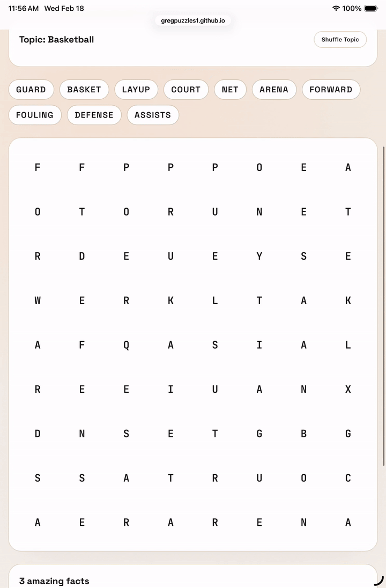

# Word Search Puzzle Generator

An interactive word search puzzle game featuring multiple categories and difficulty levels. Play free word search puzzles online with topics ranging from Bible and science to geography, sports, and more!



🎮 **[Play Now](https://gregpuzzles1.github.io/word_search/)**

## 🎯 How to Play

### Getting Started
1. **Select a Category**: Choose from various categories like Bible, Science & Math, Geography, History, Arts & Culture, and more
2. **Pick a Topic**: Each category contains multiple topics with different difficulty levels (Easy, Medium, Hard)
3. **Find the Words**: Look for hidden words in the grid - they can be placed horizontally, vertically, or diagonally

### Finding Words
- **Click and Drag**: Click on the first letter of a word and drag to the last letter
- **Any Direction**: Words can be hidden in 8 different directions:
  - Horizontal (left to right or right to left)
  - Vertical (top to bottom or bottom to top)
  - Diagonal (in all four diagonal directions)
- **Track Progress**: Found words are highlighted in the grid and checked off in the word list
- **Get Hints**: Watch the word list to see which words you still need to find

### Game Features
- **Light/Dark Mode**: Toggle between themes for comfortable viewing
- **Multiple Difficulty Levels**: Choose Easy, Medium, or Hard puzzles
- **Educational Facts**: Learn amazing facts related to each topic after completing puzzles
- **Shuffle Options**: Try different topics within your favorite category
- **Responsive Design**: Play on desktop, tablet, or mobile devices

### Completing a Puzzle
When you find all the words, you'll see a celebration modal with options to:
- Try another topic in the same category
- Explore a different category
- View interesting facts about the topic you just completed

## 🎓 Amazing Facts About Word Search Puzzles

### Brain Benefits
- **Cognitive Enhancement**: Word search puzzles improve pattern recognition and visual scanning skills
- **Memory Boost**: Regularly solving word puzzles can help strengthen short-term memory and recall abilities
- **Focus & Concentration**: The hunt for hidden words trains your brain to maintain focus and filter out distractions
- **Mental Agility**: Word searches engage both the left brain (language processing) and right brain (spatial awareness)

### Historical Tidbits
- **First Published**: The first word search puzzle was created by Norman E. Gibat in 1968 in Selenby, Oklahoma
- **Original Name**: Early word searches were called "Word Seek" puzzles
- **Global Popularity**: Word search puzzles are enjoyed worldwide and have been translated into dozens of languages
- **Therapeutic Use**: Occupational therapists often use word searches to help patients recovering from brain injuries

### Educational Impact
- **Vocabulary Building**: Word searches introduce new words and reinforce spelling
- **Subject Reinforcement**: Themed puzzles help students remember key terms in science, history, geography, and other subjects
- **Stress Relief**: The methodical searching process can be meditative and help reduce anxiety
- **All Ages**: Word searches are accessible to children as young as 5 and remain engaging throughout life

### Fun Statistics
- **Speed Records**: Competitive word search solvers can complete complex 20-word puzzles in under 2 minutes
- **Grid Sizes**: Standard word searches range from 10×10 grids for beginners to 25×25 for experts
- **Word Count**: Typical puzzles contain 10-30 hidden words, though some advanced puzzles feature 50+ words
- **Digital Revolution**: Online word searches now track completion times, streaks, and provide instant validation

## 🛠️ Technologies Used

This project is built with modern web technologies:

- **React 18** - UI framework
- **TypeScript** - Type-safe JavaScript
- **Vite** - Fast build tool and dev server
- **CSS3** - Styling with custom properties for theming

## 🚀 Local Development

### Prerequisites
- Node.js (version 16 or higher)
- npm (comes with Node.js)

### Installation

1. Clone the repository:
```bash
git clone https://github.com/gregpuzzles1/word_search.git
cd word_search
```

2. Install dependencies:
```bash
npm install
```

3. Start the development server:
```bash
npm run dev
```

4. Open your browser to `http://localhost:5173`

### Build for Production

```bash
npm run build
```

The built files will be in the `dist` directory.

### Preview Production Build

```bash
npm run preview
```

## 📚 Categories Available

- **Arts & Culture** - Art, books, movies, theater, and cultural topics
- **Astronomy** - Space, planets, stars, and celestial objects
- **Bible** - Biblical names, places, and stories
- **Everyday Life** - Common objects, activities, and concepts
- **General Knowledge** - Wide-ranging topics and trivia
- **Geography** - Countries, cities, landmarks, and natural features
- **History & Civics** - Historical events, figures, and government
- **Modern Life** - Technology, social media, and contemporary topics
- **Music** - Instruments, composers, genres, and musical terms
- **Science & Math** - Biology, Chemistry, Physics, Mathematics, Engineering
- **Sports & Games** - Sports, games, and recreational activities
- **Thinking & Language** - Logic, puzzles, words, and communication
- **Transportation** - Vehicles, travel, and transportation systems

## 🎨 Features

- ✨ Clean, modern interface
- 🌓 Dark mode support
- 📱 Mobile-responsive design
- ♿ Accessible (keyboard navigation, screen reader support)
- 🎯 Multiple difficulty levels
- 📖 Educational facts for each topic
- 🔀 Randomized puzzle generation
- 💾 Automatic progress saving

## 🤝 Contributing

Contributions are welcome! Feel free to submit issues or pull requests to help improve the game.

## 📄 License

This project is open source and available for educational and personal use.

## 🎮 Start Playing!

Visit **[https://gregpuzzles1.github.io/word_search/](https://gregpuzzles1.github.io/word_search/)** to start playing now!

---

*Built with ❤️ for puzzle enthusiasts and learners of all ages*
